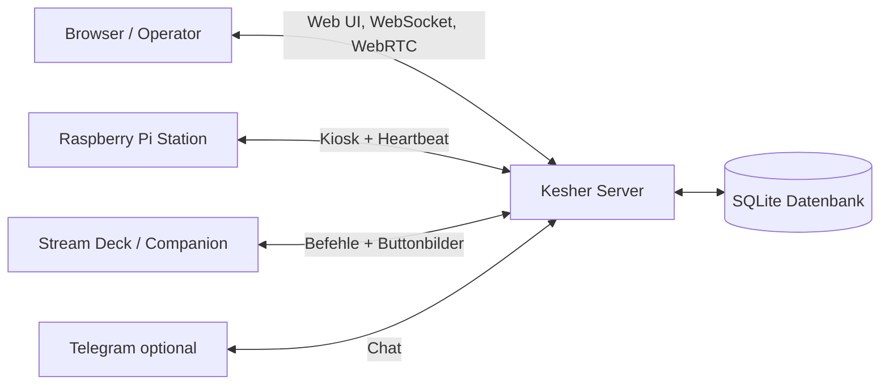

# Vorstellung

Kesher ist ein lokales, webbasiertes Intercom-System für Live-Produktionen. Operatoren öffnen Kesher im Browser oder auf einer festen Raspberry-Pi-Station und sprechen über Party-Lines, Direct PTT oder Broadcast-Gruppen miteinander.

## Wofür Kesher da ist

- Kommunikation für Regie, Kamera, Ton, Bühne und weitere Produktionsrollen
- Push-to-Talk und Always-On
- Rollen und Rechte statt fest verdrahteter Geräte
- Browser-Clients, Raspberry-Pi-Kiosks und Stream Decks über Companion
- lokale Datenhaltung auf dem eigenen Server

## Hauptbestandteile

## Was beim Vorführen wichtig ist

1. Nutzer wählen eine Rolle und melden sich an.
2. Rollen bestimmen, welche Party-Lines gehört oder besprochen werden dürfen.
3. PTT, Direct PTT und Broadcast werden in Echtzeit über das Backend geroutet.
4. Raspberry Pis sind feste Browser-Stationen mit Auto-Login.
5. Companion/Stream Deck ist eine Steueroberfläche; die Logik bleibt in Kesher.
6. Die Daten liegen lokal in SQLite.

## Demo-Ablauf

1. Kesher im Browser öffnen.
2. Zwei Rollen anmelden, zum Beispiel Regie und Kamera.
3. Party-Line hören/sprechen zeigen.
4. Direct PTT zeigen.
5. Adminbereich mit Rollen, Party-Lines und Monitoring zeigen.
6. Raspberry-Pi-Status oder Companion-Buttons zeigen, falls vorhanden.
