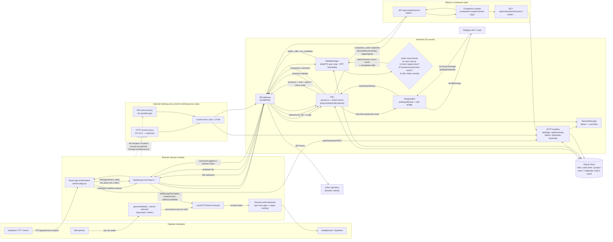
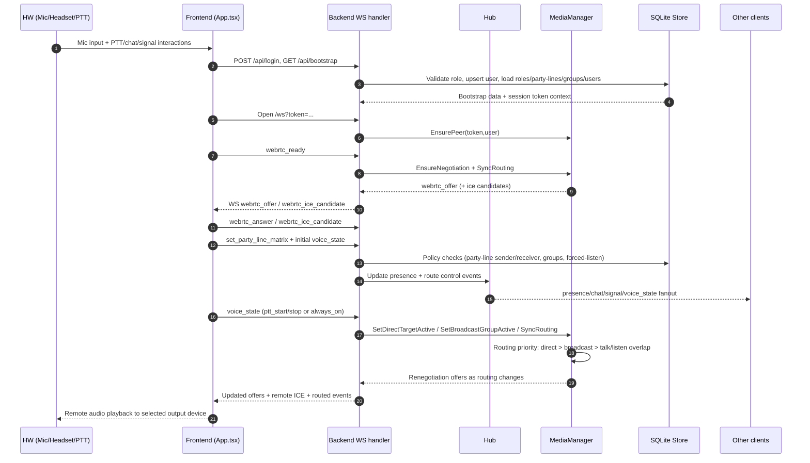
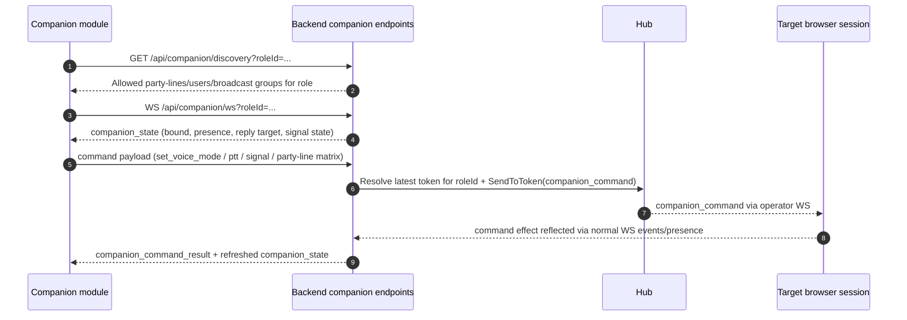
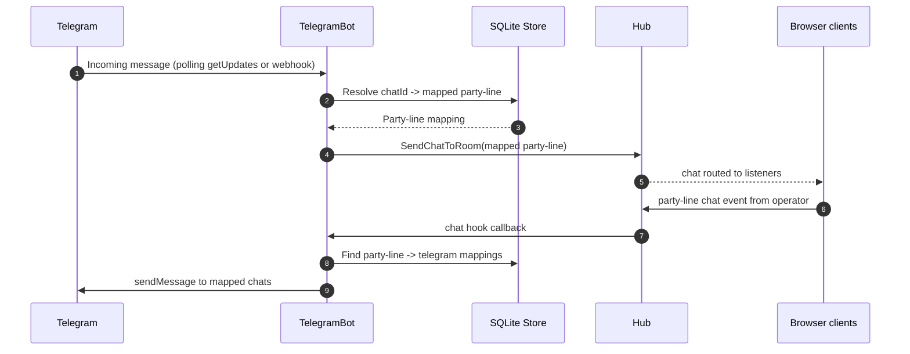

# Kesher Architecture & Information Flow

This document visualizes how information flows across the system, including the full operator loop:
`HW/browser -> frontend -> backend -> frontend -> HW`, plus related companion/telegram/proxy paths.

## 1) System architecture and flow map (detailed)

## 2) Primary realtime operator loop (sequence detail)

## 3) Companion control bridge (sequence detail)

## 4) Telegram chat bridge (sequence detail)

